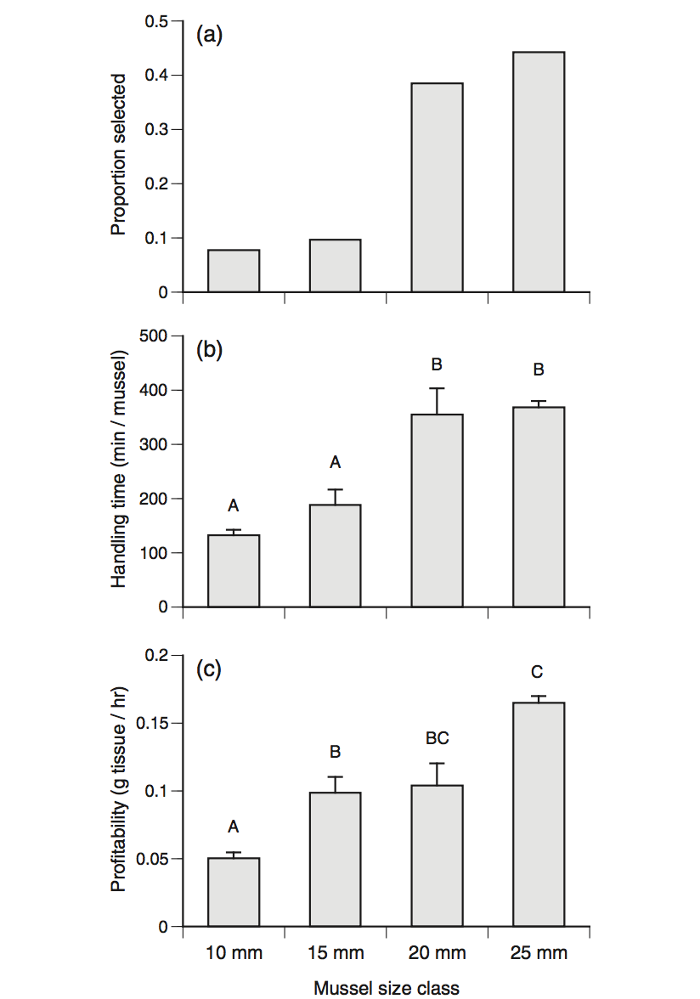

graphics homework
================
Sandra Emry
2016-09-29

original graph
--------------



Gooding RA, Harley CDG (2015) Quantifying the Effects of Predator and Prey Body Size on Sea Star Feeding Behaviors. Biol. Bull. 228: 192–200

This study looked at how the size of Pisaster ochraceus, and its prey, Mytilus trossulus, affect predatory behaviour.

The graph shows three feeding criteria of seastars for different sizes of mussels. The data shows that seastars profit more from eating larger mussels and select larger mussels more often. However, handling time is the longest for larger mussels.

data manipulation
-----------------

``` r
# read in data
seastars <- read.csv(file = "./data/hw01_data.csv")
feeding <- read.csv(file = "./data/hw01_data_2.csv")

# load packages
suppressMessages(library(tidyverse))

# examine data
str(seastars)
```

    ## 'data.frame':    24 obs. of  9 variables:
    ##  $ container         : Factor w/ 8 levels "A1","A2","B1",..: 1 2 1 2 1 2 3 4 3 4 ...
    ##  $ run               : Factor w/ 3 levels "3_26","3_31",..: 1 1 2 2 3 3 1 1 2 2 ...
    ##  $ seastar1Arm_length: num  25 24 19.6 20 25.6 26.6 23 27 23.8 21.8 ...
    ##  $ seastar2Arm_length: num  30 25 21.6 25 28.4 24.4 25 25 25.6 25.2 ...
    ##  $ mean_arm_length   : num  27.5 24.5 20.6 22.5 27 25.5 24 26 24.7 23.5 ...
    ##  $ mussel_size_mm    : int  10 10 10 10 10 10 15 15 15 15 ...
    ##  $ eaten_day_seastar : num  5.5 4.1 2.5 3.5 6 5 2.3 3.1 1.75 0.75 ...
    ##  $ g_eaten_day       : num  0.598 0.446 0.272 0.38 0.652 ...
    ##  $ feeding_time_2    : num  12.12 9.04 5.51 7.71 13.22 ...

``` r
str(feeding)
```

    ## 'data.frame':    13 obs. of  8 variables:
    ##  $ Trial                  : Factor w/ 2 levels "08-11-20","08-11-21": 1 1 1 2 1 1 1 2 1 1 ...
    ##  $ Seastar                : int  11 18 20 34 2 9 15 29 3 5 ...
    ##  $ Prey_size              : int  10 10 10 10 15 15 15 15 20 20 ...
    ##  $ Wet_weight             : num  11.9 17.6 11.8 14.4 17.6 ...
    ##  $ Handling_time_min      : int  146 104 146 133 150 160 169 273 389 259 ...
    ##  $ Profitability_g_per_min: num  0.000745 0.001046 0.000745 0.000818 0.001946 ...
    ##  $ feeding_time_1_hr_d    : num  10.79 7.68 10.79 9.83 5.27 ...
    ##  $ X                      : logi  NA NA NA NA NA NA ...

``` r
# rename variables
feeding <- feeding %>% 
  rename(prey_size = Prey_size, 
         prof = Profitability_g_per_min,
         feed_time = feeding_time_1_hr_d, 
         hand_time = Handling_time_min,
         seastar = Seastar) 

# calculate proportion of mussels eaten in each size class
seastars %>% 
  mutate(total_mussels_eaten = sum(eaten_day_seastar)) %>% 
  group_by(mussel_size_mm) %>% 
  summarise(total_eaten_per_size = sum(eaten_day_seastar)) %>% View

feeding %>% 
  group_by(prey_size) %>% 
  summarise(total_eaten_per_size = sum(seastar)) %>% View
```

updated plots
-------------

Box plot of handling time vs mussel size class

``` r
# handling time vs mussel size 
ggplot(feeding, aes(x = as.factor(prey_size), y = hand_time)) + 
  geom_boxplot(outlier.colour = "green") +
  geom_jitter(position = position_jitter(width = 0, height = 0), alpha = 1/2) + 
  ylab("handling time (min/mussel)") +
  xlab("mussel size class") +
  scale_x_discrete(labels = c("10" = "10 mm", "15" = "15 mm",
                              "20" = "20 mm", "25" = "25 mm")) +
  theme_bw() +
  expand_limits(y = c(0, 500))
```


Box plot of profitability vs mussel size

``` r
ggplot(feeding, aes(x = as.factor(prey_size), y = prof)) + 
  geom_boxplot(outlier.colour = "green") + 
  geom_jitter(position = position_jitter(width = 0, height = 0), alpha = 1/2) + 
  ylab("profitability (g tissue/hr)") + 
  xlab("mussel size class") + 
  scale_x_discrete(labels = c("10" = "10 mm", "15" = "15 mm",
                              "20" = "20 mm", "25" = "25 mm")) +
  theme_bw()
```


explanation of new plots
------------------------

The new graphs use boxplots instead of bar graphs. This makes it easier for readers to see the distribution of data by including each data point. It also makes the sample size clearer, which is not shown in the original graphs. Any outliers in the data are shown in green.
